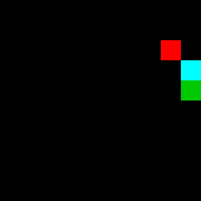
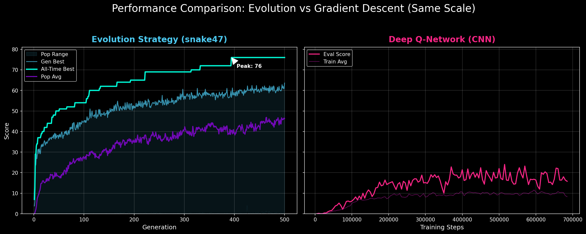

# snake47

<p align="center">
  
</p>

A comprehensive study of learning-based AI for the classic Snake game. This repository documents the journey from a slow, vision-based Deep Q-Network (DQN) to a highly efficient and effective Evolutionary Strategy (ES) agent.

## Project Vision

The goal was to create an agent that could learn genuine spatial reasoning without algorithmic shortcuts (like pathfinding and Hamiltonian cycles). Just learning from simple sensor inputs, no hand-holding algorithms.

While the initial CNN-based DQN approach struggled to achieve significant board coverage, the **Evolutionary Strategy** approach successfully achieved near-optimal performance on a 10x10 grid. I tried  NoisyNets, reward shaping, survival pretraining (learning without apples first) but with hours of training nothing broke past ~15-20 avg on the CNN, while 15 generations of evolution agents could already match that performance in a fraction of time.

## Approach Comparison

| Approach | Avg Score | Peak | Training Time |
|----------|-----------|------|---------------|
| ES (snake47) | ~60 | 76 | ~75 min |
| DQN + CNN | ~15-20 | ~30 | hours (1M+ steps) |


## Performance Comparison: Evolution vs. CNN

The logs from **snake47 (ES)** against a traditional **Deep Q-Network (CNN)** approach. The results highlights the efficiency of biological-inspired learning for Snake:




> **Insight**: The CNN is too inefficient for a task like Snake, requiring intense compute power for relatively worse performance. The ES agent, using direct sensors and a survival-of-the-fittest mechanic, is able to discover optimal strategies while also running much faster.


## Repository Structure

- **`evolution/`**: 
  - `es_agent.py`: Pure O(1) feature extraction and MLP architecture.
  - `train_es.py`: High-performance evolution loop (parallelized).
  - `watch_es.py`: Interactive visualization of the trained agent.
  - `checkpoints/`: Saved models including the peak performer.
  - `logs/`: Detailed CSV logs of the training history.
- **`dqn/`**: The original Deep Q-Network attempts.
  - Includes model definitions, training scripts, and legacy phase history.
  - `legacy/SNAKE_OLD.py`: A self-contained, high-complexity Dueling DQN with vision kernels (legacy benchmark).
- **`results/`**: Visualizations of performance milestones and training curves.
- **`snake_env.py`**: The core Snake environment shared by all agents.

## Key Performance: snake47

| Metric | Performance |
|--------|-------------|
| **Peak Score** | **76** (78% board coverage) |
| **Best Avg (5 games)** | **63.6** (65.6% coverage) |
| **Training Time** | ~85 minutes from scratch |
| **Complexity** | ~1,700 parameters |

snake47 uses only **16 basic sensors** (danger/food direction/distances) and learned to fill the board through pure natural selection, outperforming much larger CNN models by an order of magnitude in both speed and score.

**Sensors**

- Danger signals (3): Will I die if I go straight/left/right?
- Food direction (4): Which way is food?
- Food distance (1): Manhattan distance normalized
- Wall distances (4): Steps to wall in each direction
- Body distances (3): Steps to own body in each direction
- Board state (1): How full is the board?


## Quick Start

### Installation
```bash
pip install -r requirements.txt
```

### Watch the Peak Performer 
```bash
python evolution/watch_es.py --checkpoint evolution/checkpoints/final_best.npz
```

### Train your own Evolution Agent
```bash
python evolution/train_es.py --generations 500 --workers (add how much you want to use) 
```
12 workers use around 70-80 percent of my 8 core 16 thread CPU, one generation on avg takes about 5-10 seconds depending on your population size and progress.


### Visualize Progress
```bash
python evolution/plot_es_progress.py
```

## Authors
Developed as a study in Evolutionary Strategies vs reinforcement learning.
